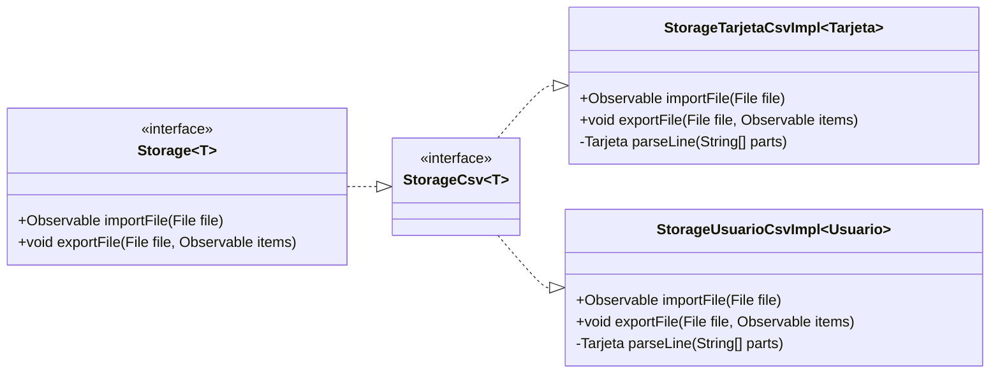
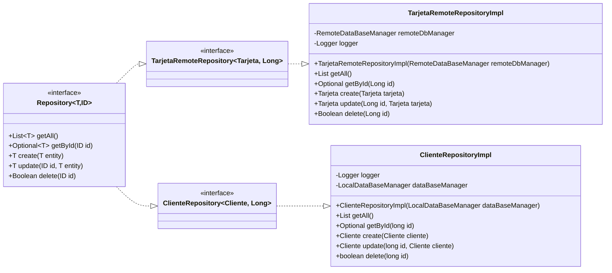
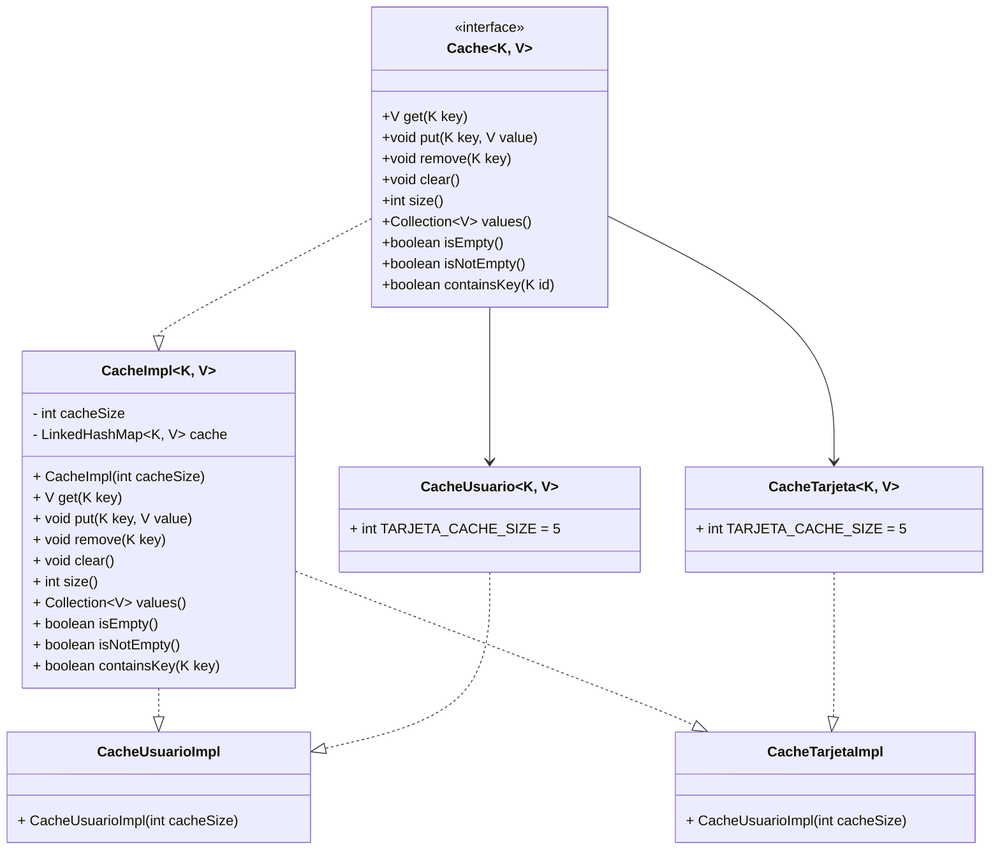

# Clientes Bancos

En esta práctica, desarrollaremos un servicio bancario donde registraremos tanto a los clientes como a sus respectivas tarjetas. Cada cliente podrá poseer ninguna, una o varias tarjetas, pero cada tarjeta deberá estar siempre vinculada a un cliente.

<!--Models-->


## Tecnologías Utilizadas

- **Java**
- **PostgreSQL**
- **SQLite**
- **Docker**
- **TestContainers**
- **Jackson**
- **Apache Commons CSV**
- **WebFlux**
- **Lombok**
- **SLF4J con Logback**
- **JUnit y Mockito**
- **Gradle**
- **Git**
- **Postman**
## Base de Datos

Este proyecto utiliza dos bases de datos para gestionar la información de clientes y tarjetas de crédito:

### *PostgreSQL*

- **Descripción**: Base de datos relacional utilizada para almacenar la información de las tarjetas de crédito.
- **Contenedor Docker**: La base de datos se gestiona a través de un contenedor Docker, facilitando su despliegue y
  configuración.
- **Configuración**: Se debe definir la configuración de conexión en el archivo `application.properties`.

### *SQLite*

- **Descripción**: Base de datos ligera utilizada para almacenar la información de los clientes de forma local.
- **Uso**: Ideal para entornos de desarrollo y pruebas, permite almacenar datos sin necesidad de un servidor de base de
  datos completo.
- **Configuración**: La conexión a la base de datos SQLite también debe ser especificada en el
  archivo `application.properties`.

```yaml
# Servicios de almacenamiento de datos
# Desarrollo
services:
  # PostgreSQL
  postgres-db:
    container_name: cards-db_postgres
    image: postgres:12.0-alpine
    restart: always
    env_file: .env
    environment:
      POSTGRES_USER: ${DATABASE_USER}
      POSTGRES_PASSWORD: ${DATABASE_PASSWORD}
      POSTGRES_DB: ${POSTGRES_DATABASE}
    ports:
      - ${POSTGRES_PORT}:5432
    volumes:
      - ./database/cards/init.sql:/docker-entrypoint-initdb.d/init.sql
      - postgres-db-data:/var/lib/postgresql/data
    networks:
      - banco-network

  # App de banco
  banco-app:
    build:
      context: .
      dockerfile: Dockerfile
    container_name: banco-app
    env_file: .env
    networks:
      - banco-network
    depends_on:
      - postgres-db

networks:
  banco-network:
    driver: bridge

volumes:
  postgres-db-data:
```

## Importación y Exportación de Datos

El sistema permite la importación y exportación de datos en varios formatos para facilitar la gestión de la información
de clientes y tarjetas. A continuación se detallan los formatos y sus respectivas funcionalidades:

### Tarjetas

- **Importación**
    - **Formato**: CSV
    - **Descripción**: Permite importar datos de tarjetas de crédito desde un archivo CSV. Se validará la información de
      cada tarjeta antes de su almacenamiento en la base de datos PostgreSQL.

- **Exportación**
    - **Formato**: CSV
    - **Descripción**: Permite exportar los datos de las tarjetas de crédito en un archivo CSV, incluyendo todos los
      atributos relevantes como número, titular y fecha de caducidad.

### Clientes

- **Importación**
    - **Formato**: CSV
    - **Descripción**: Permite importar información del cliente desde un archivo CSV utilizando la API REST. Los datos
      serán validados para asegurar que cumplan con los requisitos establecidos.

- **Exportación**
    - **Formato**: CSV
    - **Descripción**: Permite exportar los datos del cliente a un archivo CSV, facilitando su uso en otras aplicaciones
      o sistemas.

<!--Storage-->



## Repositorio

- **Patrón Repositorio**: La abstracción del repositorio facilita el manejo de datos entre la aplicación y las bases de datos (PostgreSQL y SQLite).
- **Interfaces Genéricas**: El repositorio sigue un enfoque genérico para manejar entidades como `Cliente` y `Tarjeta`.



## Caché

- La aplicación utiliza una implementación de caché personalizada, `CacheImpl`, que emplea un **LinkedHashMap** para almacenar elementos. 
- La caché se vacía de manera eficiente cuando se alcanza el límite de elementos, manteniendo sólo los más recientes.




## Calidad y Pruebas

El proyecto implementa diversas prácticas y herramientas para asegurar la calidad del código y la correcta funcionalidad
de la aplicación. A continuación se describen los principales enfoques utilizados:

- **Pruebas Unitarias**:
    - Se realizan pruebas unitarias para verificar el funcionamiento de componentes individuales, asegurando que cada
      unidad de código opere como se espera.

- **Pruebas de Integración**:
    - Se llevan a cabo pruebas de integración para evaluar la interacción entre diferentes módulos y servicios de la
      aplicación, garantizando que funcionen correctamente en conjunto.

- **Mockito**:
    - Se utiliza Mockito para crear simulacros de objetos en las pruebas, facilitando la comprobación de interacciones y
      comportamientos sin depender de implementaciones concretas.

- **JUnit**:
    - Se emplea JUnit como framework de pruebas para estructurar y ejecutar las pruebas unitarias y de integración de
      manera eficiente.

- **TestContainers**:
    - Se utilizan contenedores de TestContainers para probar la aplicación en un entorno similar al de producción,
      permitiendo la creación y destrucción dinámica de bases de datos durante las pruebas.

- **Cobertura de Código**:
    - Se monitorea la cobertura de código para asegurar que un porcentaje adecuado del código esté cubierto por pruebas,
      identificando áreas que necesiten más atención.

- **Revisiones de Código**:
    - Se realizan revisiones de código para asegurar que el código cumpla con los estándares de calidad y las mejores
      prácticas antes de ser fusionado.

## Autores del programa

<table align="center">
  <tr>
    <td align="center">
      <a href="https://github.com/KevinSanchez5">
        
        <br/>
        <sub><b>Kelvin</b></sub>
      </a>
    </td>
    <td align="center">
      <a href="https://github.com/christiangregorio">
        
        <br/>
        <sub><b>Christian</b></sub>
      </a>
    </td>
    <td align="center">
      <a href="https://github.com/Diegonovi">
        
        <br/>
        <sub><b>Diego</b></sub>
      </a>
    </td>
    <td align="center">
      <a href="https://github.com/Diokar017">
        
        <br/>
        <sub><b>Oscar</b></sub>
      </a>
    </td>
    <td align="center">
      <a href="https://github.com/TomasVaquerin">
        
        <br/>
        <sub><b>Tomas</b></sub>
      </a>
    </td>
  </tr>
</table>
